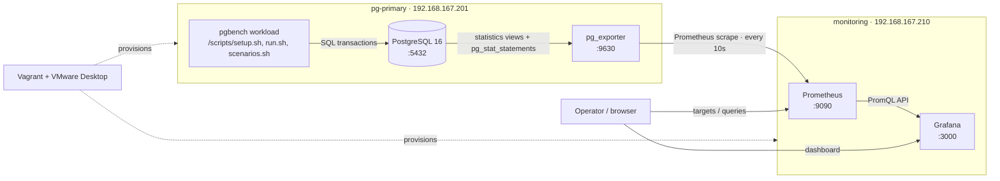

# PostgreSQL Monitoring Stack

A reproducible PostgreSQL monitoring stack demo built with Vagrant, PostgreSQL 16, `pg_exporter`, Prometheus, and Grafana. It provisions two Ubuntu VMs, generates a `pgbench` workload, and visualizes PostgreSQL health, activity, query statistics, and database metrics.

This repository demonstrates the monitoring stack in a local environment. It is not a production hardening guide.

## Architecture



See [docs/architecture.md](docs/architecture.md) for the component responsibilities, data flow, ports, and metric groups.

## Components

| Component | Role |
|---|---|
| `pg-primary` | PostgreSQL 16 and `pg_exporter`; custom collectors include activity, index, settings, and `pg_stat_statements` metrics. |
| `monitoring` | Prometheus scrapes the exporter every 10 seconds; Grafana is provisioned with the Prometheus data source and PostgreSQL dashboard. |
| `scripts/setup.sh` | Creates the pgbench role/database and initializes the sample tables. |
| `scripts/run.sh` | Runs a configurable pgbench workload. |
| `scripts/scenarios.sh` | Creates idle-in-transaction and row-lock-wait activity for dashboard exploration. |
| `scripts/verify.sh` | Checks service readiness, target health, and representative custom metrics from the monitoring VM. |

## Prerequisites

- Windows with VMware Workstation/Player and the Vagrant VMware Desktop provider plugin installed and licensed as required by your VMware setup.
- Vagrant.
- At least 4 GB available memory and about 2 CPU cores for the two VMs.
- Network access to download the Ubuntu box and provision packages.
- Host connectivity to the private subnet `192.168.167.0/24`.

The `Vagrantfile` pins the VM box to `bento/ubuntu-24.04`, PostgreSQL to major version 16, pg_exporter to 1.4.1, and Grafana to 13.2.1.

## Deploy

Open PowerShell in the repository directory. Set the monitoring password in the current shell, then provision both VMs:

```powershell
$env:PG_MONITORING_PASSWORD = Read-Host "Monitoring database password"
vagrant up
```

The password is passed to the PostgreSQL VM during provisioning. Keep it out of committed files and command history. If the environment is already provisioned, `vagrant up` starts the existing VMs without reprovisioning; to apply provisioner changes, use `vagrant provision`.

Create the workload database and tables inside the primary VM:

```powershell
vagrant ssh pg-primary
```

Then, in the VM shell:

```bash
cd /vagrant
read -rsp 'Workload password: ' PG_WORKLOAD_PASSWORD
printf '\n'
export PG_WORKLOAD_PASSWORD
./scripts/setup.sh
./scripts/run.sh
```

To create visible activity for the activity and lock panels, run:

```bash
SCENARIO_DURATION=45 ./scripts/scenarios.sh
```

The setup and workload scripts use `pgbench` defaults of scale 10, 300 seconds, 5 clients, and 2 jobs. Override them with `PGBENCH_SCALE`, `PGBENCH_DURATION`, `PGBENCH_CLIENTS`, and `PGBENCH_JOBS` as needed.

## Open the dashboards

- Grafana: [http://192.168.167.210:3000](http://192.168.167.210:3000)
- Prometheus: [http://192.168.167.210:9090](http://192.168.167.210:9090)
- PostgreSQL exporter: [http://192.168.167.201:9630/metrics](http://192.168.167.201:9630/metrics)

The Grafana dashboard is provisioned from `configs/grafana/dashboards/postgresql-overview.json` in the **PostgreSQL** folder. It includes server/settings, database and table sizes, sessions and connection states, transactions, index usage, and query performance panels. Query statistics are collected from `pg_stat_statements`; the provisioning config enables the extension on the `postgres` database.

The provisioning does not override Grafana's initial admin credentials. On a fresh VM, sign in with the package defaults (`admin` / `admin`) and set a local password when prompted.

## Verify

After provisioning and running `scripts/setup.sh` plus a workload, open a shell on the monitoring VM:

```powershell
vagrant ssh monitoring
```

Then run:

```bash
cd /vagrant
./scripts/verify.sh
```

The script prints a `PASS` line for Prometheus readiness, Grafana readiness, an up `pg_exporter` target, PostgreSQL activity metrics, and `pg_stat_statements` query metrics. Run it after the workload has produced query statistics. It exits nonzero and prints `FAIL` if any required check is unavailable.

The live run captured for this repository returned:

```text
PASS | Prometheus is ready
PASS | Grafana is healthy
PASS | Prometheus pg_exporter target is up
PASS | PostgreSQL activity metrics are present
PASS | pg_stat_statements query metrics are present

All monitoring checks passed.
```

The full captured output is shown above and was recorded from the live monitoring VM.

For a quick manual check, visit Prometheus **Status → Targets** and confirm `pg_exporter` is `UP`. In Grafana, open the PostgreSQL dashboard and confirm panels have data.

## Screenshots

These are the dashboard evidence images currently included in the repository:

| Evidence | Screenshot |
|---|---|
| PostgreSQL server settings and general counters | [postgresql-settings.png](screenshots/postgresql-settings.png) |
| Activity states and connections over time | [activity-connections.png](screenshots/activity-connections.png) |
| Database and table size panels | [database-sizes.png](screenshots/database-sizes.png) |
| Database transaction counters | [database-transactions.png](screenshots/database-transactions.png) |
| Query performance from `pg_stat_statements` | [query-performance-pg-stat-statements.png](screenshots/query-performance-pg-stat-statements.png) |
| Prometheus Targets page showing the exporter `UP` | [prometheus-targets.png](screenshots/prometheus-targets.png) |
| Verification script PASS output | [See verification result](#verify) |

The Grafana PNG files cover dashboard sections rather than a single full-page dashboard overview. The Prometheus Targets screenshot and verification output above were captured from the live services.

## Clean reproduction

To recreate the environment from scratch, run the following from PowerShell after saving any VM data you need. `vagrant destroy -f` removes both VMs and their local data disks:

```powershell
vagrant destroy -f
$env:PG_MONITORING_PASSWORD = Read-Host "Monitoring database password"
vagrant up
```

Then repeat the workload setup and verification steps. The `.vagrant/` and `.secrets/` directories are excluded from Git.

To remove only the demo database and role while retaining the VMs, run `./scripts/cleanup.sh` from the `pg-primary` VM. This deletes the configured workload database and role.

## Repository map

```text
.
├── configs/
│   ├── grafana/                 # Provisioned data source, dashboard, and provider
│   ├── pg_exporter/             # Custom PostgreSQL metric collectors
│   └── prometheus/              # Scrape configuration
├── docs/architecture.md         # Detailed topology and data flow
├── provision/                   # VM setup scripts
├── scripts/                     # Workload, scenario, cleanup, and verification scripts
├── screenshots/                 # Dashboard evidence captures
└── Vagrantfile                  # Two-VM monitoring stack definition
```

## Security and scope

- Never commit `.secrets/`, credentials, or generated VM state.
- The monitoring stack uses private-network endpoints and demonstration credentials supplied locally by the operator. Review authentication, TLS, firewall rules, secret handling, resource limits, and availability requirements before adapting it for shared or production use.
- The exporter connection currently uses `sslmode=disable` on the local PostgreSQL VM. This is limited to the stack's VM-local connection.
