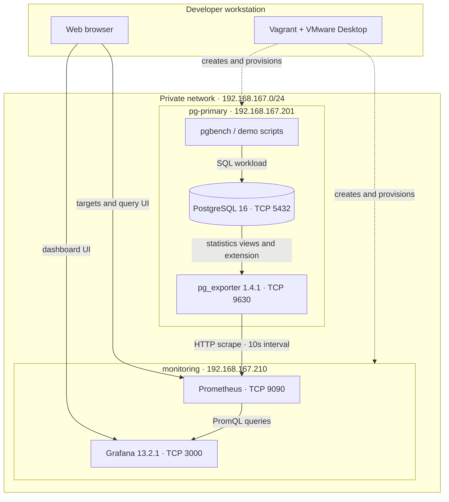

# Architecture

## Topology

## Components

| Component | Configuration | Responsibility |
|---|---|---|
| Vagrant | `Vagrantfile` | Defines the two Ubuntu 24.04 VMs, private IPs, VMware resource allocations, and provisioners. |
| PostgreSQL | `provision/primary.sh` | Runs PostgreSQL 16, grants the monitoring role `pg_monitor`, enables `pg_stat_statements`, and serves the pgbench demo database. |
| pg_exporter | `provision/primary.sh`, `configs/pg_exporter/custom_metrics.yml` | Connects locally to PostgreSQL, exposes default and custom collectors on port 9630. |
| Prometheus | `configs/prometheus/prometheus.yml` | Scrapes `pg-primary:9630` every 10 seconds and stores time series locally on the monitoring VM. |
| Grafana | `provision/monitoring.sh`, `configs/grafana/` | Uses the provisioned Prometheus data source and serves the PostgreSQL overview dashboard. |
| Workload scripts | `scripts/` | Prepare pgbench data, produce query load, demonstrate idle/lock states, clean the demo objects, and verify telemetry. |

## Data flow

1. Vagrant creates `pg-primary` and `monitoring` on the private subnet and runs the matching provisioning scripts.
2. `scripts/setup.sh` creates a workload role and pgbench database on `pg-primary`. `scripts/run.sh` generates transactions; `scripts/scenarios.sh` creates idle-in-transaction and row-lock-wait examples.
3. PostgreSQL exposes runtime statistics through built-in statistics views and the `pg_stat_statements` extension. The exporter connects to the local server using its dedicated `monitoring` role.
4. Prometheus scrapes the exporter endpoint every 10 seconds and stores the metrics.
5. Grafana sends PromQL queries to the provisioned Prometheus data source and renders the overview dashboard. The operator can also inspect scrape status and run queries directly in Prometheus.

## Metric groups

The exporter combines the package's default collectors with project-specific collectors:

- **Settings:** additional tuning parameters such as WAL buffers, random page cost, and I/O concurrency.
- **Activity:** connection counts grouped by database, role, state, and wait event.
- **Index:** per-index scan counts and on-disk size.
- **Query statistics:** calls and execution time grouped by database, user, and query ID, sourced from `pg_stat_statements`. SQL text is not exported as a label.
- **Built-in database metrics:** server health, database sizes, table sizes, transactions, and other stock exporter metrics used by dashboard panels.

## Ports and access

| Service | Address | Purpose |
|---|---|---|
| PostgreSQL | `192.168.167.201:5432` | Workload connections; exporter uses loopback on the database VM. |
| pg_exporter | `192.168.167.201:9630` | Prometheus scrape endpoint. |
| Prometheus | `192.168.167.210:9090` | Targets page and PromQL API/UI. |
| Grafana | `192.168.167.210:3000` | PostgreSQL dashboard. |

The PostgreSQL HBA rules added by provisioning allow the exporter role to connect from localhost. The Grafana and Prometheus endpoints are intended for access from the local host/private lab network.
